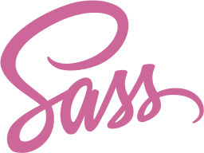
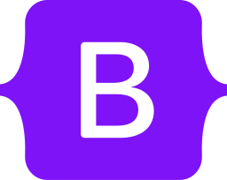

# Hi 👋, I'm AikawaShota.

I am a high school student who wants to become a web engineer.
I am developing tools and web apps for developers on my own while attending a technical school.

## Languages and Tools

    
    
    
    
    
    
    
    
    
    
    
    

    
    

